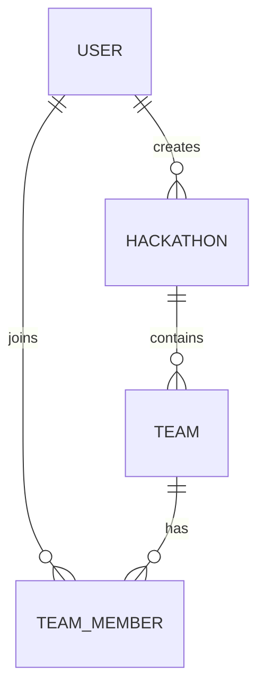

# Database schema

The core schema is defined by the TypeORM entities and migration files in the backend service.

```mermaid
erDiagram
  USER ||--o{ HACKATHON : creates
  HACKATHON ||--o{ TEAM : contains
  USER ||--o{ TEAM_MEMBER : joins
  TEAM ||--o{ TEAM_MEMBER : has
```
